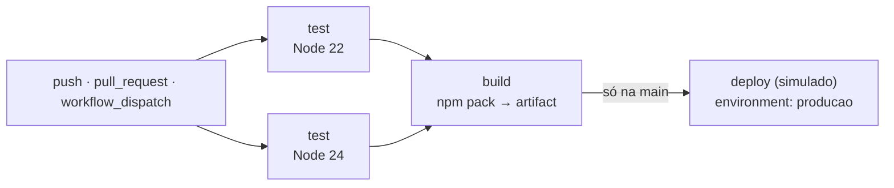

# ✅ todo-actions

[](https://github.com/pepezot/todo-actions/actions/workflows/main.yml)

App ToDo mínimo para demonstrar **CI/CD com GitHub Actions**. Feito para o seminário de Tópicos em Programação 3 (UTFPR Ponta Grossa, 2026/2).

O app é propositalmente simples, porque o assunto é o pipeline. O projeto não tem **nenhuma dependência externa**: servidor HTTP e testes usam só módulos nativos do Node.js.

## Sumário

1. [Stack](#stack)
2. [Estrutura de pastas](#estrutura-de-pastas)
3. [Pré-requisitos](#pré-requisitos)
4. [Rodando localmente](#rodando-localmente)
5. [API](#api)
6. [Publicando no GitHub e configurando o pipeline](#publicando-no-github-e-configurando-o-pipeline)
7. [Como o pipeline está estruturado](#como-o-pipeline-está-estruturado)
8. [Demonstração: quebrando o build de propósito](#demonstração-quebrando-o-build-de-propósito)
9. [Solução de problemas](#solução-de-problemas)

---

## Stack

| Parte | Tecnologia | Por quê |
|---|---|---|
| Runtime | Node.js 24 LTS (compatível com 22) | Já traz servidor HTTP, `fetch` e test runner |
| Servidor | `node:http` | Zero dependências, então o `npm ci` do CI é instantâneo |
| Testes | `node:test` + `node:assert` | Nada para instalar |
| Front-end | HTML + JavaScript puro | Sem etapa de build |
| CI/CD | GitHub Actions | O assunto da apresentação |

## Estrutura de pastas

```
todo-actions/
├── .github/
│   └── workflows/
│       └── main.yml        # pipeline CI/CD: test → build → deploy
├── public/
│   └── index.html          # interface web
├── src/
│   ├── todos.js            # regras de negócio: validação + armazenamento em memória
│   ├── app.js              # rotas HTTP da API
│   └── server.js           # ponto de entrada: sobe o servidor na porta 3000
├── test/
│   ├── todos.test.js       # testes unitários das regras de negócio
│   └── app.test.js         # testes da API (sobe o servidor numa porta livre)
├── .gitignore
├── package.json
├── package-lock.json
└── README.md
```

## Pré-requisitos

- **Node.js 22 ou superior.** Confira com `node --version`.
- **Git.**
- **Conta no GitHub.**

## Rodando localmente

### 0. Baixar o código

```bash
git clone https://github.com/pepezot/todo-actions.git
cd todo-actions
```

O `git clone` copia o repositório para uma pasta nova `todo-actions/`, e o `cd` entra nela. Todos os comandos abaixo rodam dentro dessa pasta.

### 1. Instalar

```bash
npm ci
```

Como não há dependências, o comando só confere se o `package-lock.json` está íntegro. É o mesmo passo que o pipeline executa.

### 2. Subir o app

```bash
npm start
```

Acesse <http://localhost:3000>. Há duas variações:

- **Outra porta:** `PORT=8080 npm start`.
- **Reiniciar sozinho a cada arquivo salvo:** `npm run dev`, que usa `node --watch`.

> Os dados ficam em memória, então reiniciar o servidor apaga as tarefas. É intencional: sem banco de dados, não há nada para configurar na demo.

### 3. Rodar os testes

```bash
npm test
```

O comando executa `node --test`, que encontra sozinho os arquivos `*.test.js` da pasta `test/`.

## API

| Método | Rota | Corpo | Respostas |
|---|---|---|---|
| `GET` | `/health` | — | `200 {"status":"ok"}` |
| `GET` | `/api/todos` | — | `200` lista de tarefas |
| `POST` | `/api/todos` | `{"title": "..."}` | `201` tarefa criada · `400` título ou JSON inválido |
| `PATCH` | `/api/todos/:id` | — | `200` alterna a conclusão · `404` não encontrada |
| `DELETE` | `/api/todos/:id` | — | `204` removida · `404` não encontrada |

---

## Publicando no GitHub e configurando o pipeline

> **A ordem importa.** Configure o environment e o secret **antes** do primeiro push. O push na `main` dispara o pipeline na hora, e sem o secret o job de deploy falha.

### 1. Criar o repositório vazio

No GitHub, vá em **New repository**, dê o nome `todo-actions` e escolha **Public**. Não marque as opções de README, .gitignore ou licença.

> **Por que público?** No plano GitHub Free, *environments* só existem em repositórios públicos. Além disso, minutos de Actions em repositório público são gratuitos.

### 2. Criar o environment e o secret

1. **Criar o environment:** abra **Settings → Environments → New environment** e use o nome `producao`, exatamente assim, sem acento.
2. **Aprovação manual (opcional, recomendada para a demo):**
   - Marque **Required reviewers** e adicione o seu usuário.
   - Se você for o único revisor, **não** marque *Prevent self-review*.
3. **Criar o secret:** na mesma tela, em **Environment secrets → Add environment secret**, preencha:
   - **Name:** `DEPLOY_TOKEN`
   - **Value:** qualquer texto falso, por exemplo `token-falso-da-demo-123`

### 3. Enviar o código

```bash
git init -b main
```

Cria o repositório Git local, já com a branch principal chamada `main`, que é a branch que o workflow observa.

```bash
git add .
```

Coloca todos os arquivos na área de preparação (*staging*). O `.gitignore` impede que `node_modules/` e pacotes `.tgz` entrem.

```bash
git commit -m "feat: app ToDo com pipeline GitHub Actions"
```

Cria o primeiro commit com a mensagem informada.

```bash
git remote add origin https://github.com/pepezot/todo-actions.git
```

Registra o repositório do GitHub com o apelido `origin`. Se você usa chave SSH, use o endereço `git@github.com:pepezot/todo-actions.git`.

```bash
git push -u origin main
```

Envia a branch `main` para o GitHub. A flag `-u` liga a branch local à remota, e daí em diante basta `git push`. **Esse push dispara o pipeline.**

### 4. Acompanhar a execução

Abra a aba **Actions** do repositório e clique na execução **CI/CD**.

Se você marcou *Required reviewers*, o job **Deploy (simulado)** fica em *Waiting*. Para liberar, clique em **Review deployments → producao → Approve and deploy**.

---

## Como o pipeline está estruturado

O arquivo completo, comentado linha a linha, é [`.github/workflows/main.yml`](.github/workflows/main.yml).



### Gatilhos (`on:`)

| Evento | Quando acontece | O que roda |
|---|---|---|
| `push` na `main` | Um commit chega à `main` | test → build → deploy |
| `pull_request` para a `main` | Um PR é aberto ou atualizado | test → build (o deploy é pulado) |
| `workflow_dispatch` | Alguém clica em **Run workflow** | test → build → deploy (se executado na `main`) |

### Jobs

| Job | Depende de | O que faz | Conceito demonstrado |
|---|---|---|---|
| `test` | — | Matriz Node 22 e 24: `checkout`, `setup-node`, `npm ci`, `npm test` | Runner GitHub-hosted, steps `uses` e `run`, matriz, jobs paralelos |
| `build` | `test` | `npm pack` + `upload-artifact` | `needs`, artifacts passando arquivos entre jobs |
| `deploy` | `build` | `download-artifact`, deploy simulado com secret, resumo da execução | `if`, environment, secret mascarado, job summary |

### Segurança aplicada

- **Token com o mínimo de permissão.** `permissions: contents: read` deixa o `GITHUB_TOKEN` só ler o repositório.
- **Secret isolado.** Ele existe só no job `deploy`, que nunca roda em pull request.
- **Secret entregue via `env:`.** O valor não é interpolado com `${{ }}` dentro do script.
- **Limite de tempo.** `timeout-minutes: 10` em todos os jobs, para que nenhum job travado consuma minutos indefinidamente.
- **Concorrência controlada.** `concurrency` cancela execuções antigas de PR, mas nunca interrompe a `main`.
- **Versões das actions.** As oficiais (`actions/*`) estão fixadas por tag major (`@v7`, `@v8`), versões que rodam em Node 24. Para actions de **terceiros**, fixe pelo SHA completo do commit.

> **Aviso sobre o secret no log.** O step de deploy imprime o secret **de propósito**, para mostrar o mascaramento `***`. Isso só é aceitável porque o valor é falso. O mascaramento não pega valores transformados (base64, cortados etc.). Em projeto real, nunca imprima secrets.

---

## Demonstração: quebrando o build de propósito

```bash
git switch -c demo/quebra-validacao
```

Cria a branch `demo/quebra-validacao` e já muda para ela.

Agora, no editor, abra `src/todos.js` e comente a linha `if (normalized === '') throw ...` dentro de `validateTitle` (no VS Code: `Ctrl+/`).

```bash
npm test
```

Opcional: mostra a falha localmente antes de enviar.

```bash
git commit -am "demo: remove validação de título vazio"
```

A flag `-a` inclui no commit todos os arquivos **já rastreados** que foram modificados; `-m` define a mensagem.

```bash
git push -u origin demo/quebra-validacao
```

Envia a branch. O Git imprime no terminal um link para abrir o pull request.

Abra o PR por esse link. Na aba **Actions**, os dois jobs de teste ficam vermelhos, e `build` e `deploy` nem começam. Depois da demo, feche o PR **sem** fazer merge.

---

## Solução de problemas

| Sintoma | Causa provável | Correção |
|---|---|---|
| Deploy falha com "Secret ausente" | Secret não criado, ou criado fora do environment `producao` | Crie o secret no environment e clique em **Re-run failed jobs** |
| `npm ci` falha: "package.json and package-lock.json are not in sync" | `package.json` editado sem atualizar o lock | Rode `npm install` localmente e faça commit do `package-lock.json` |
| "Environments" não aparece em Settings | Repositório privado no plano Free | Torne o repositório público |
| O workflow não dispara | Arquivo fora de `.github/workflows/` ou branch com outro nome | Confira o caminho do arquivo e se a branch se chama `main` |
| Deploy parado em *Waiting* | Aprovação manual ativada no environment | **Review deployments → Approve and deploy** |
| `EADDRINUSE` no `npm start` | Porta 3000 ocupada | `PORT=3001 npm start` |
